### Procedure

In our experiment, there are 3 motors which can be turned ON or OFF through a PLC. But we wish to have maximum simultaneous operation limiting to 2 motors, i.e. any 2 motor may run at a time. Also, any one may run by itself. 

Let us see basic diagram of the circuitry: 

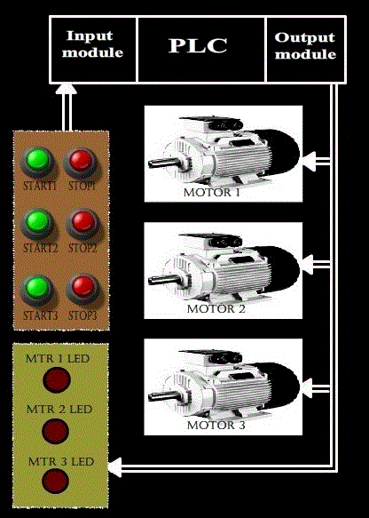
 

#### Ladder Logic design :

Now let us see how the ladder logic of maximum simultaneous operation limiter is implemented using PLC. 

##### Our assumption :
<ul type=disc style="text-align: justify;">
<li>All the three motors have their own start and stop push buttons. Both start and stop push buttons are of normally open types. </li> 

<li>Since inputs and outputs are less, 8-point I/O module is sufficient, where CPU resides in slot 0, input module resides in slot 0, input module resides in slot 1 and output module in   slot 2. </li> 

<li>Let us assign address for the input and output signals of the PLC:   

<ul type=square>
<li>START1 (Normally open push button) = I :1/0</li> 
<li>START2 (Normally open push button) = I :1/1</li> 
<li>START3 (Normally open push button) = I :1/2</li> 
<li>STOP1 (Normally open push button) = I :1/3</li> 
<li>STOP2 (Normally open push button) = I :1/4</li> 
<li>STOP3 (Normally open push button) = I :1/5</li> 
<li>MOTOR1 = O :2/0</li> 
<li>MOTOR2 = O :2/1</li> 
<li>MOTOR3 = O :2/2 </li> 
<li>MTR 1 LED = O :2/3 </li> 
<li>MTR 2 LED = O :2/4 </li> 
<li>MTR 3 LED = O :2/5</li> 
</ul>
</li>
</ul>

Let us see its ladder logic diagram : 

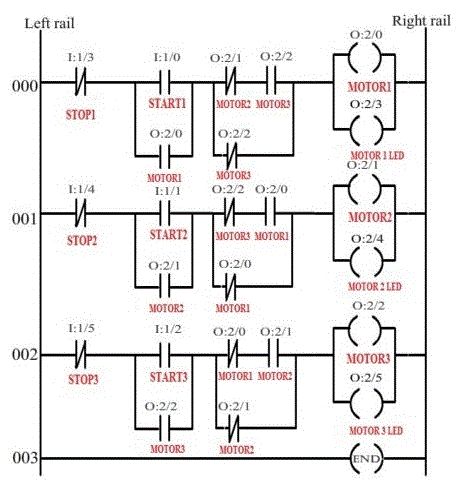 

 The above ladder diagram has three rung.
 
 

Let us see the function of each rung individually.  

#### Rung 000 :

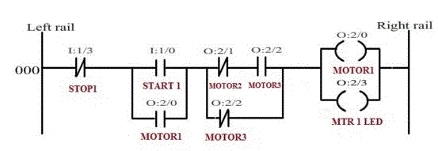

The above rung is used to energize the MOTOR1. As per our requirement, when the MOTOR1 is energized, then either MOTOR2 or MOTOR3 can be energized. But they both cannot be energized together. Or, in other words, when either MOTOR2 or MOTOR3 is energized, then also MOTOR1 can be activated (energized).  
START1 and STOP1 are normally open push button. Pressing STOP1 push button will de-establish the logical continuity.STOP1 instruction (-|/|-) is true all the time unless STOP1 push button is pressed. The START1 push button used to start the MOTOR1. Since START1 a push button, its signal has to be latched.

Consider the figure below:

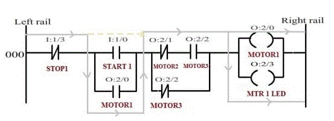

The above diagram shows the logical continuity established when MOTOR2 is OFF and MOTOR3 is ON. When MOTOR2 is OFF the MOTOR2 instruction (-|/|-) become true and when MOTOR3 is ON, then MOTOR3 instruction (-| |-) become true. So when the START1 push button is pressed, logical continuity is established between left rail and right rail.

Consider the figure below:

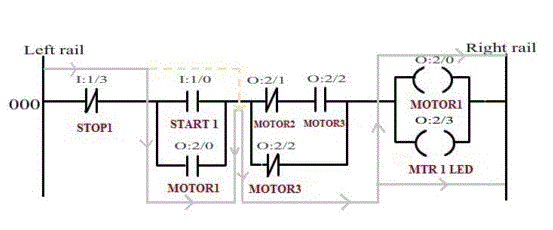

The above diagram shows the logical continuity established when MOTOR3 is OFF and working condition of MOTOR2 is irrelevant (i.e. can be OFF or ON).As per our requirement, if MOTOR2 is ON then MOTOR3 has to be OFF for the MOTOR1 to run. So this rung is true when either only MOTOR1 is running or when MOTOR1 and MOTOR2 are running together.  

#### Rung 001 :

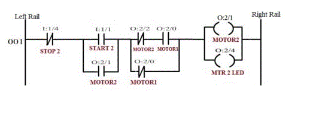

The above rung is used to energize the MOTOR2. As per our requirement, when the MOTOR2 is energized, then either MOTOR3 or MOTOR1 can be energized. But they both cannot be energized together. Or, in other words, when either MOTOR3 or MOTOR1 is energized, then also MOTOR2 can be activated (energized).   
 START2 and STOP2 are normally open push button. Pressing STOP2 push button will de-establish the logical continuity.STOP2 instruction (-|/|-) is true all the time unless STOP2 push button is pressed. The START2 push button used to start the MOTOR2. Since START2 a push button, its signal has to be latched.  

Consider the figure below:

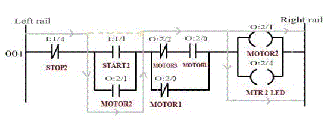

The above diagram shows the logical continuity established when MOTOR3 is OFF and MOTOR1 is ON. When MOTOR3 is OFF the MOTOR3 instruction (-|/|-) become true and when MOTOR1 is ON, then MOTOR1 instruction (-| |-) become true. So when the START2 push button is pressed, logical continuity is established between left rail and right rail. 

Consider the figure below:

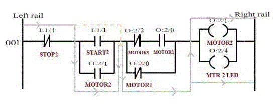

The above diagram shows the logical continuity established when MOTOR1 is OFF and working condition of MOTOR3 is irrelevant (i.e. can be OFF or ON).As per our requirement, if MOTOR3 is ON then MOTOR1 has to be OFF for the MOTOR2 to run. So this rung is true when either only MOTOR2 is running or when MOTOR2 and MOTOR3 are running together. 

#### Rung 002 :

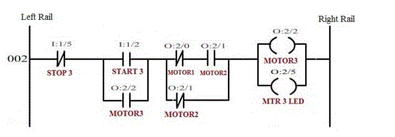

The above rung is used to energize the MOTOR3. As per our requirement, when the MOTOR3 is energized, then either MOTOR1 or MOTOR2 can be energized. But they both cannot be energized together. Or, in other words, when either MOTOR1 or MOTOR2 is energized, then also MOTOR3 can be activated (energized).  

START3 and STOP3 are normally open push button. Pressing STOP3 push button will de-establish the logical continuity.STOP3 instruction (-|/|-) is true all the time unless STOP3 push button is pressed. The START3 push button used to start the MOTOR3. Since START3 a push button, its signal has to be latched.  

Consider the figure below:

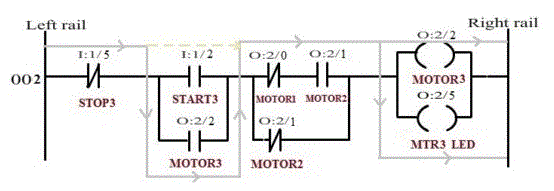

The above diagram shows the logical continuity established when MOTOR1 is OFF and MOTOR2 is ON. When MOTOR1 is OFF the MOTOR1 instruction (-|/|-) become true and when MOTOR2 is ON, then MOTOR2 instruction (-| |-) become true. So when the START3 push button is pressed, logical continuity is established between left rail and right rail. 

Consider the figure below:

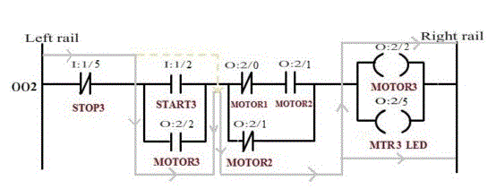

The above diagram shows the logical continuity established when MOTOR2 is OFF and working condition of MOTOR1 is irrelevant (i.e. can be OFF or ON).As per our requirement, if MOTOR1 is ON then MOTOR2 has to be OFF for the MOTOR3 to run. So this rung is true when either only MOTOR3 is running or when MOTOR3 and MOTOR1 are running together.  

The following screen shots explains the operation :

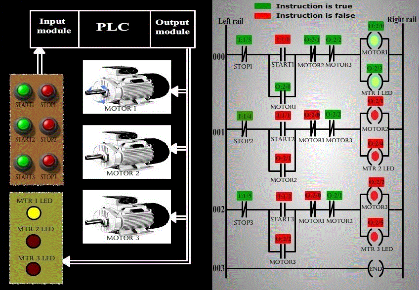

 The above screen shot represents the condition when MOTOR1 is running. 

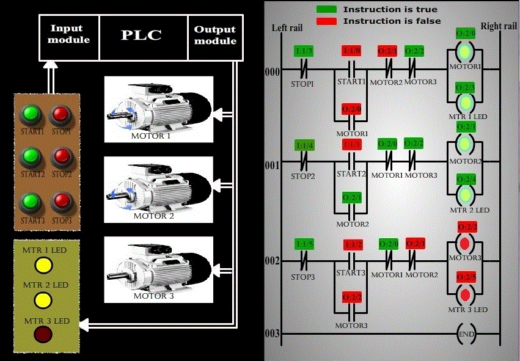

 The above screen shot represents the condition when MOTOR2  is also running. 

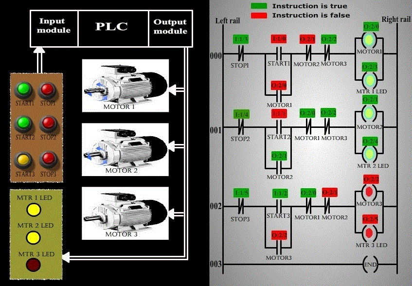

The above screen shot represents the condition when MOTOR1 and MOTOR2 are running and pressing of START3 button,  does not energize MOTOR3, thus achieving Maximum Simultaneous Operation of two motor’s limiting using a PLC.

